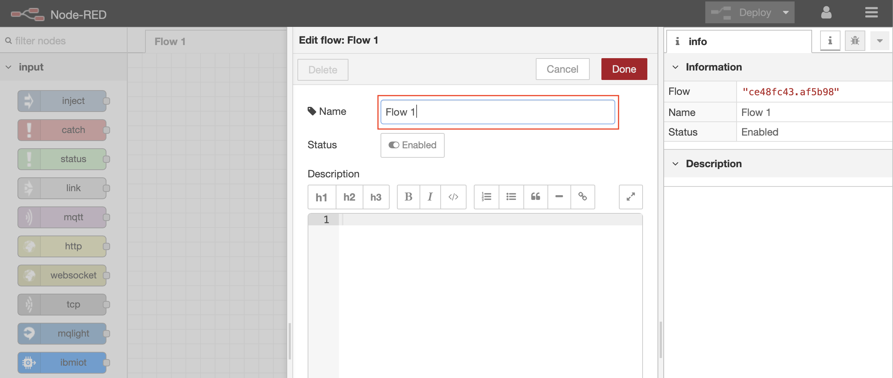

# Node-RED Set up and Configuration in IBM Cloud

## Lab Objectives

In this lab you will set up Node-RED.  

You will learn:

- Node-RED Visual Programming
- How to install additional Node-RED nodes
- How to import a prebuilt flow from GitHub.

## Introduction

Node-RED is an open-source
Node.js application that provides a visual programming editor that makes it easy to wire together flows.

### Step 1 - Create an account for Node-RED from a suitable cloud provider

You can get a free Node-RED instance from [FRED(Free Node-RED)](https://users.sensetecnic.com/app/services)
It should take a couple of minutes to create an account (no credit card needed) and start Node-RED

- The Node-RED Visual Programming Editor will open with a default flow
- On the left side is a palette of nodes that you can drag onto the flow
- You can wire nodes together to create a program
- Double Click on the **Flow 1** tab header
- Rename this tab from **Flow 1** to **Receive ESP8266 Data**
  

### Step 3 - How to install additional Node-RED nodes (Information only)

- Your instance of Node-RED may includes just a small subset of Node-RED nodes. The Node-RED palette can be extended with over one thousand additional nodes for different devices and functionality. These NPM nodes can be browsed at <http://flows.nodered.org>
If you are using FRED, you will need to select "Add or Remove Nodes" from the Tools menu, on the leftmost tab.
You will be able to search available nodes, by category, and you will be able to install the ones you want, simply by selecting them.

### Step 4 - How to import a prebuilt flow from GitHub

In this step, you will learn how to Import a prebuilt flow from GitHub

- Since configuring Node-RED nodes and wiring them together requires many steps to document in screenshots, there is an easier way to build a flow by importing a prebuilt flow into your IoT Starter Application.
- Not here in Step 4, but in several sections below, there will be a **Get the Code** link.
- When instructed in those later sections, open the Get the Code github URL, mark or Ctrl-A to select all of the text, and copy the text for the flow to your Clipboard.
- Click on the Node-RED Menu (6), then Import (7), then Clipboard (8).

- Paste the text of the flow into the **Import nodes** dialog and press the red **Import** button.

- The new flow will be imported into a new tab in the Node-RED Editor.
- Click the **Deploy** button on the top of menu bar to deploy the Node-RED flow.
